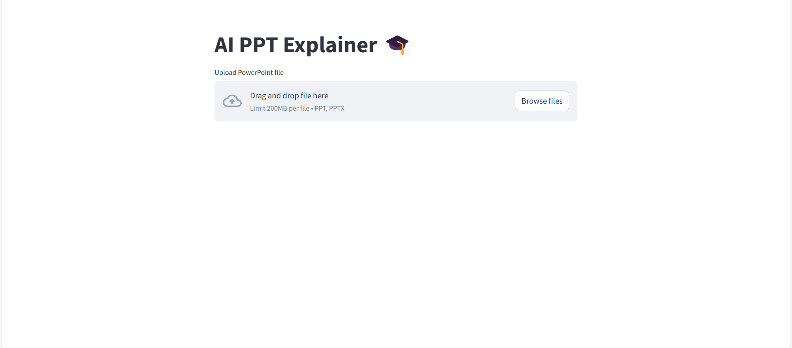
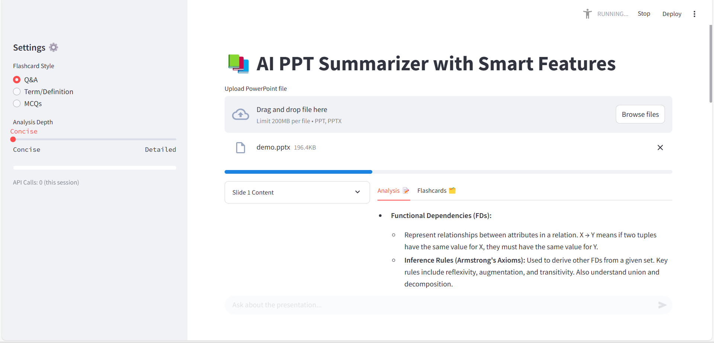
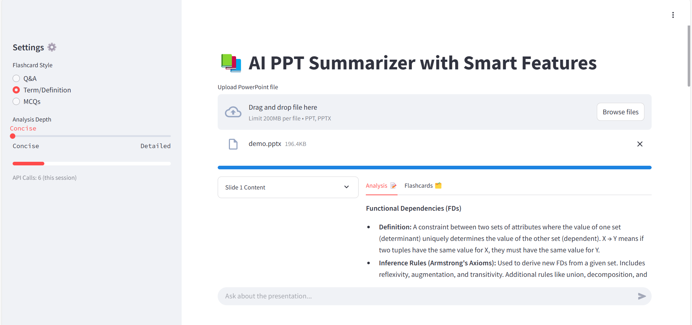
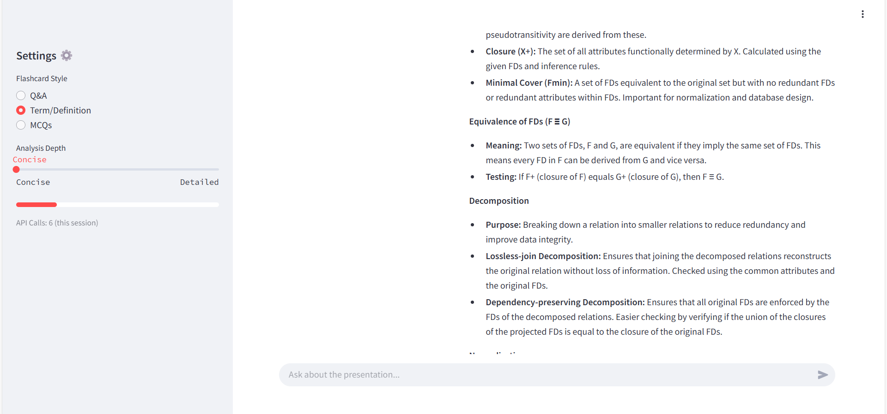
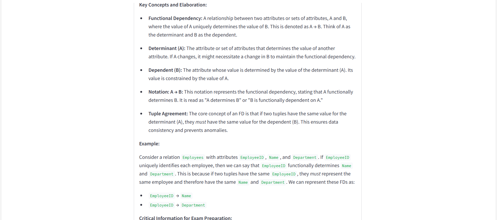
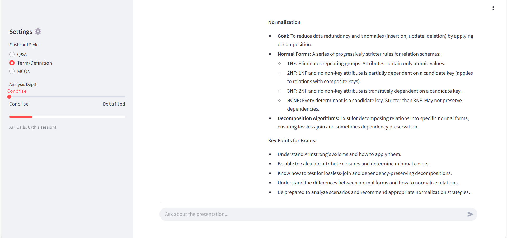

# AI PPT Summarizer 🤖📊

Automatically generates slide-by-slide explanations for PowerPoint presentations using Google's Gemini AI.



## Key Features
- **Instant Upload**: Drag-and-drop PPT/PPTX files
- **AI Analysis**: Gemini-powered explanations
- **Study Focus**: Key points & exam tips
- **Responsive UI**: Real-time progress tracking

## Setup
```bash
# Clone repository
git clone https://github.com/karanveerksb/AI_PPT_Summarizer.git
cd AI_PPT_Summarizer

# Create virtual environment
python -m venv venv
source venv/bin/activate  # Linux/Mac
venv\Scripts\activate    # Windows

# Install dependencies
pip install -r requirements.txt

# Configure Gemini API key
echo "GEMINI_API_KEY = 'your-api-key'" > .streamlit/secrets.toml
Usage
bash
Copy
streamlit run app.py
## Usage
Step 1: Upload Presentation

Supported formats: .ppt, .pptx

Step 2: Processing


Step 3: View Results





Includes explanations and study tips per slide


Tech Stack
AI Engine: Google Gemini Pro

Frontend: Streamlit

PPT Processing: python-pptx

Environment: Python 3.9+