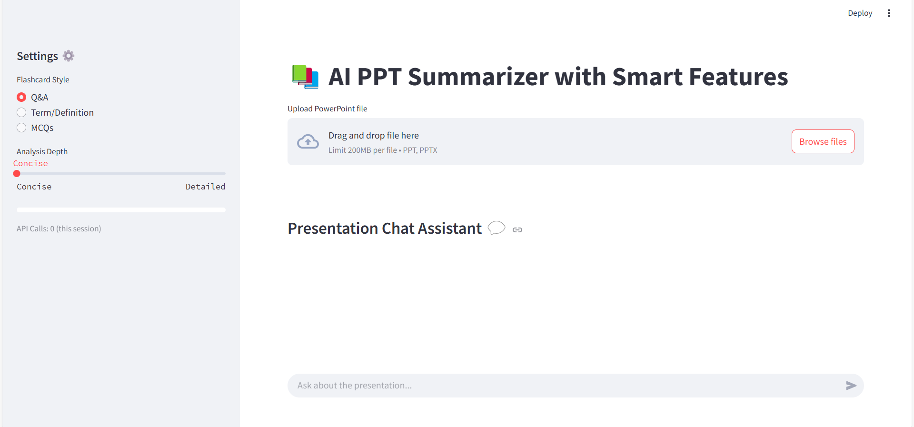
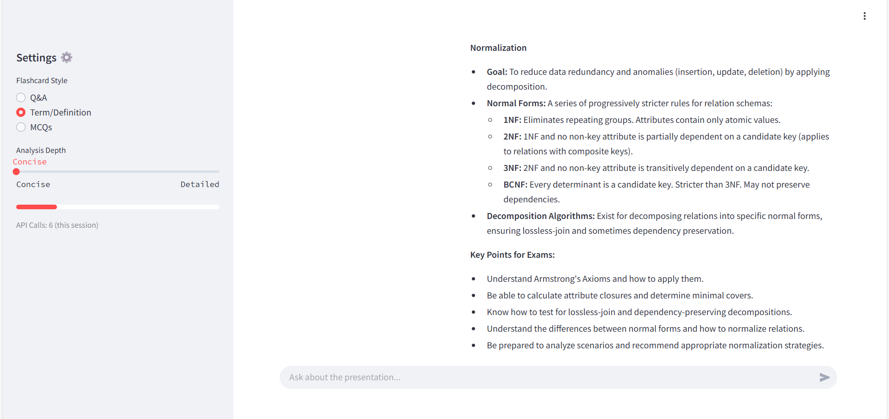

# AI PPT Summarizer

Effortlessly generate slide-by-slide explanations, study tips, and flashcards for PowerPoint presentations using Google's Gemini AI.



---

## 🚀 Key Features

- **Instant Upload**: Drag-and-drop support for `.ppt` and `.pptx` files.
- **AI-Powered Analysis**: Generates detailed explanations and exam-focused insights for each slide.
- **Flashcard Generation**: Create flashcards in various formats (Q&A, Term/Definition, MCQs) for quick review.
- **Interactive Chat Assistant**: Ask questions about your presentation content and get real-time answers.
- **Responsive UI**: Real-time progress tracking and export options for flashcards.
- **Robust Processing**: Caching and retry mechanisms for seamless API handling.

---

## 🛠️ Setup

Follow these steps to set up the project on your local machine:

### 1. Clone the Repository
git clone https://github.com/karanveerksb/AI_PPT_Summarizer.git
cd AI_PPT_Summarizer


### 2. Create a Virtual Environment
For Linux/Mac
python -m venv venv
source venv/bin/activate

For Windows
python -m venv venv
venv\Scripts\activate


### 3. Install Dependencies
pip install -r requirements.txt


### 4. Configure Your Gemini API Key
Add your Gemini API key to the `.streamlit/secrets.toml` file:
GEMINI_API_KEY = "your-api-key"


---

## ▶️ Usage

### Step 1: Launch the Application
Run the app using Streamlit:
streamlit run app.py


### Step 2: Upload Your Presentation
Drag and drop your `.ppt` or `.pptx` file into the upload interface.


### Step 3: Processing
The app processes each slide, generating detailed analysis, flashcards, and study tips in real time.


### Step 4: View Results
Explore slide content, AI-generated insights, and flashcards. Export flashcards to CSV if needed.





### Step 5: Interactive Chat Assistant 
Use the chat assistant to ask questions about your slides and receive instant answers.


---

## 🧰 Tech Stack

- **AI Engine**: Google Gemini-1.5-Pro  
- **Frontend**: Streamlit  
- **PPT Processing**: `python-pptx`  
- **Environment**: Python 3.9+  

---

## **Folder Structure**
```
AI_PPT_Summarizer/
├── app.py
├── assets/
├── requirements.txt
├── .gitignore
└── README.md

```